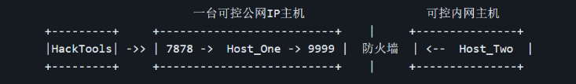
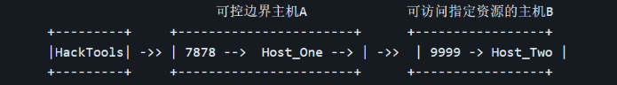
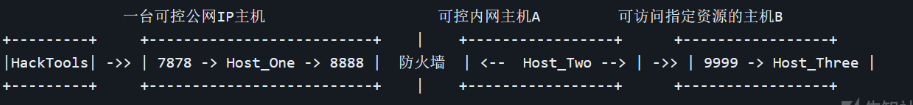

# README

<h1>yuze🤗 (项目正在重构中，向方便的多级代理模式改进)</h1>

## 简介

yuze 是一款纯C实现的轻量的内网穿透工具，支持正向，反向socksv5代理隧道的搭建，支持EarthWorm (ew) 的全部数据转发方式，可跨平台使用。

特点

- 支持正向、反向代理
- 支持多种数据转发方式，穿透复杂的网络环境
- 支持任意以tcp协议为基础的服务
- 体积小, 极轻量的内网穿透工具 （仅有25kb）
- 跨平台，支持Windows、Linux （ 2024.1.31 update）


## 使用简介

下面是对具体功能的使用场景和演示，为了方便使用，工具的部分功能承袭了ew，lcx的命名

1. yuze提供的正向代理

使用场景

```
可控主机有公网IP且可开启任意监听端口
```

示意图


```
a) ./yuze -m s_server -l 7878

b) HackTools可使用Host_One主机的7878端口提供的socks5代理
```


2. yuze提供的反向代理

使用场景

```
可控主机不存在公网IP，但是可出网，通过主动连接的方式建立反向socks代理。类似frp
```

示意图



```
a) ./yuze -m yuze_listen -s 7878 -e 9999
              // 在具有公网IP的主机上添加转接隧道，将7878端口收到的代理请求转交给反连9999端口的主机

b) ./yuze -m r_server -r 127.0.0.1 -s 9999
              // 将目标主机反向连接公网转接主机

c) HackTools可使用Host_One主机的7878端口提供的socks5代理
```


同时支持了ew的几种二重网络环境的数据转发方式

3. yuze_tran 使用场景

```
1.  获得目标网络内两台主机 A、B 的权限，情况描述如下：

    A 主机：存在公网 IP，且自由监听任意端口，无法访问特定资源
    B 主机：目标网络内部主机，可访问特定资源，但无法访问公网
    A 主机可直连 B 主机
```

示意图



```
a)  ./yuze -m s_server -l 9999
                // 在 Host_Two 主机上利用 s_server 模式启动 9999 端口的正向 socks 代理

b)  ./yuze -m yuze_tran -s 7878 -d 127.0.0.1 -e 9999 
                // 在Host_One上将 7878 端口收到的 socks 代理请求转交给 Host_Two 主机。

c)  HackTools可使用Host_One主机的7878端口提供的socks5代理
```


4. yuze_slave 使用场景

```
场景描述：获得目标网络内两台主机 A、B 的权限，情况描述如下：

    A 主机：目标网络的边界主机，无公网 IP，无法访问特定资源。
    B 主机：目标网络内部主机，可访问特定资源，却无法回连公网。
    A 主机可直连 B 主机
```



```
a)  ./yuze -m yuze_listen -s 7878 -e 8888
                    // 在 Host_One 公网主机添加转接隧道，将 7878 收到的代理请求
                    // 转交给反连 8888 端口的主机

b)  ./yuze -m s_server -l 9999
                    // 在 Host_Three 主机上利用 s_server 模式启动 9999 端口的正向 socks 代理

c)  ./yuze -m yuze_slave -r 127.0.0.1 -s 8888 -d 127.0.0.1 -e 9999
                    // 在 Host_Two 上，通过工具的 yuze_slave 模式，
                    // 打通Host_One:8888 和 Host_Three:9999 之间的通讯隧道

d)  HackTools可使用Host_One主机的7878端口提供的socks5代理
```


## TODO

1.  跨平台支持 ( 2024.1.31 update)
2. 通信流量加密


## 闲谈

yuze是我学习socket网络编程后产出的工具，它帮助我深入了解了内网渗透中常见基于socks协议的隧道代理，流量转发的原理。最初用go语言实现了正向、反向代理。由于编译后体积问题，改用纯C实现，支持ew的全部数据转发方式。

它的很多的灵感来自于对EarthWorm（ew）的逆向，向前辈致敬。


## 致谢

https://rootkiter.com/EarthWorm/